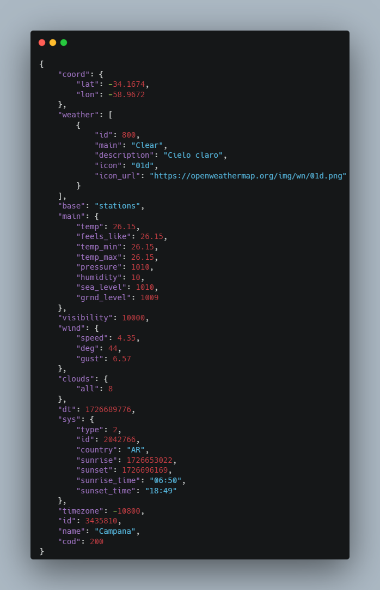

# OpenWeatherMap Rest API
A Rest API made easy for [OpenWeather](https://openweathermap.org/api)

## Technologies
 

## Installation
Clone this repository:

- git clone https://github.com/hfilippi/openweathermap-api.git
- Get your **API KEY** from [OpenWeather](https://openweathermap.org/api)
- Edit your **/src/main/resources/application.properties** file and put your API KEY in **openweathermap-org.api_key** property.
- Enjoy!

## Usage
**POST** http://[URL]:[PORT]/openweather/v1/weather?latitude=-[latitude]&longitude=[longitude]

Example:

	http://localhost:8080/openweather/v1/weather?latitude=-34.167379&longitude=-58.967189

Response example:

See the [Swagger](http://localhost:8080/swagger-ui/index.html) page for complete details.

## Authors
[hfilippi GitHub page](https://github.com/hfilippi)
